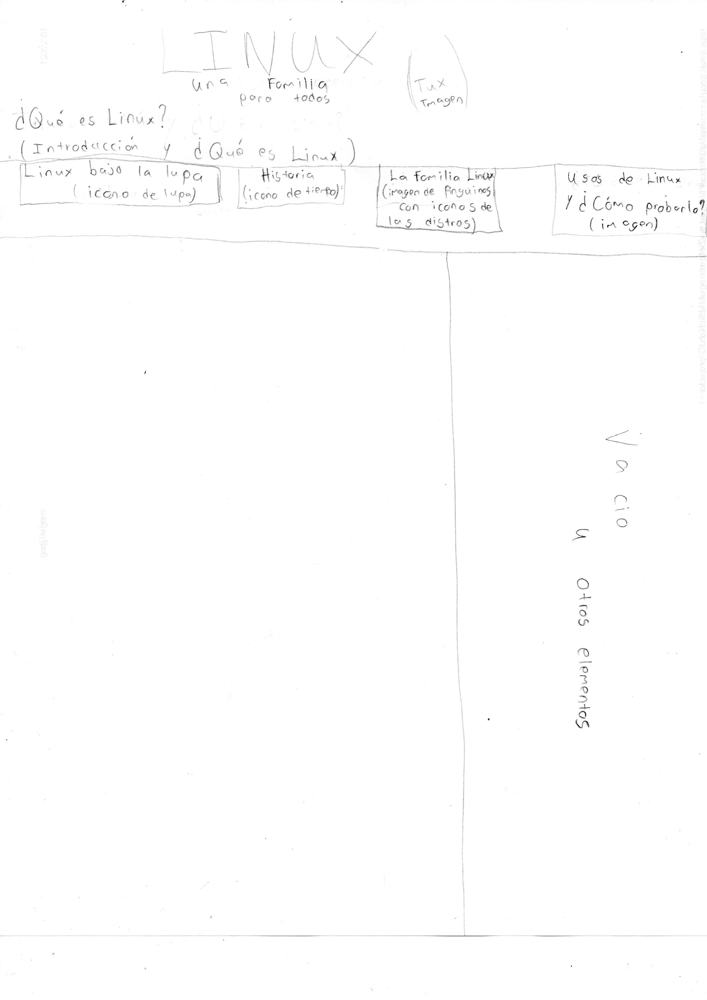
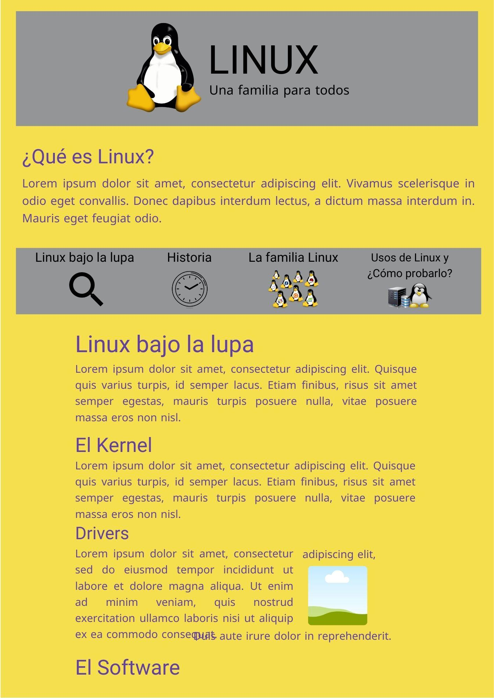

# Lluvia de Ideas
* Imágenes (algunas de fondo en las cajas y secciones)
* Barra de contenido con iconos
* Videos
* Varias cajas y secciones
* Enlaces externos (algunos en imágenes, iconos y palabras que lleven a por ejemplo descargas, enlaces a las distribuciones)
* Enlaces internos (en la barra de contenido)
* Iconos

# Obligatorio de Incluir
* Partes del texto resaltadas
* Listas
* Tablas
* Enlaces tanto externos como internos
* Selectores tanto de id como de clase
* Fuentes en el texto
* Propiedades del modelo de caja
* Imágenes con bordes
* 1 overflow en la página
* Pseudoclases con propiedades
* 2 selectores combinados y con un color o estilo asignado
* Mínimo 4 párrafos

# Prototipo

# Esqueleto

